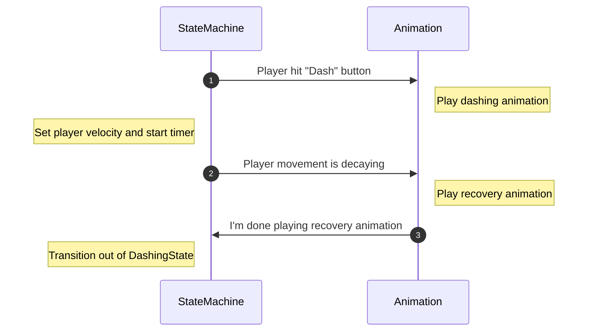

Different states will require different sequences of interaction between the code-side state machine and the animator (both frame events and StateBehavior callbacks).

Example: Dashing

```mermaid
sequenceDiagram
    autonumber
    participant SM as StateMachine
    participant A as Animation

    SM->>A: Player hit "Dash" button

    Note right of A: Play dashing animation
    Note left of SM: Set player velocity and start timer

    SM->>A: Player movement is decaying

    Note right of A: Play recovery animation

    A->>SM: I'm done playing recovery animation

    Note left of SM: Transition out of DashingState

```

