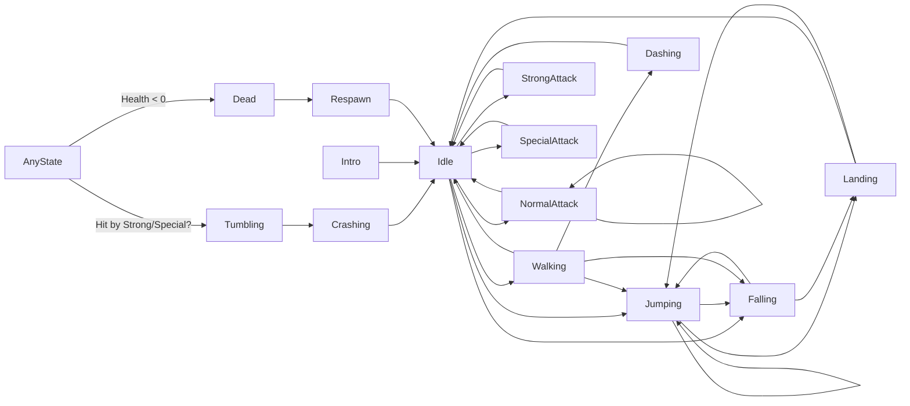

```mermaid
  graph LR;

%% Overall Architecture of Player C# State Machine %%

    %% Idle %%
      Idle-->Jumping;
      Idle-->Walking;
      Idle-->Falling;
      Idle-->NormalAttack;
      Idle-->StrongAttack;
      Idle-->SpecialAttack;

    %% Jumping %%
      Jumping-->Landing;
      Jumping-->Falling;
      Jumping-->Jumping;

    %% Falling %%
      Falling-->Landing;
      Falling-->Jumping;

    %% Tumbling(Getting hit and being unable to do some stuff)%%
      Tumbling-->Crashing;

    %% Landing %%
      Landing-->Idle;
      Landing-->Jumping;

    %% Crashing(fall on ground, intagible) %%
      Crashing-->Idle

    %% Normal Attack %%
      NormalAttack-->Idle;
      NormalAttack-->NormalAttack;

    %% Strong Attack %%
      StrongAttack-->Idle

    %% Special Attack %%
      SpecialAttack-->Idle

    %% Walking %%
      Walking-->Idle;
      Walking-->Jumping;
      Walking-->Falling;
      Walking-->Dashing;

    %% Dashing %%
      Dashing-->Idle;

    %% Intro(maybe for intro animation) %%
      Intro-->Idle;

    %% Respawn %%
      Respawn-->Idle;

    %% Dead %%
      Dead-->Respawn;

    %% AnyState(A pseudo-state for all states transitioning) %%
      AnyState-- Health < 0 -->Dead;
      AnyState-- Hit by Strong/Special?-->Tumbling
```
